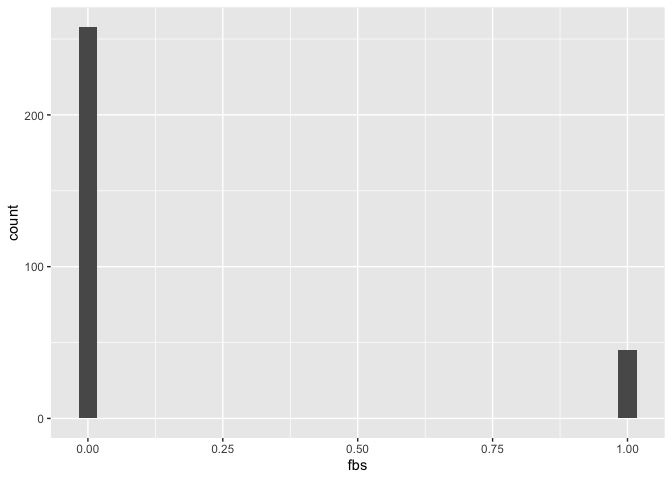
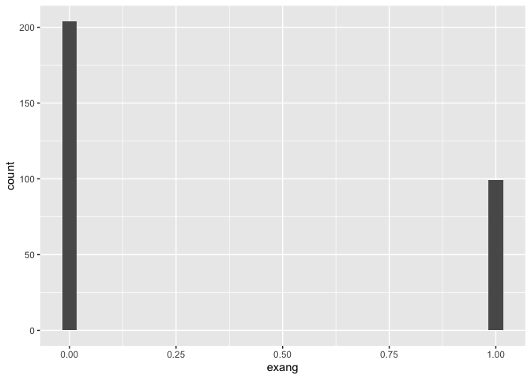
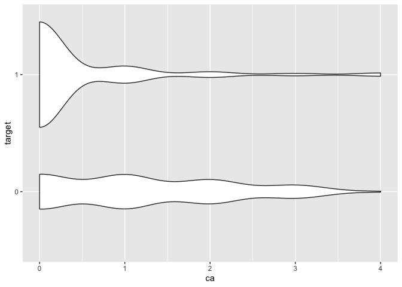

Heart Disease Prediction Using a Random Forrest Model in R
================

When I first began learning about data science, machine learning seemed
unapproachable. I thought that to understand machine learning
algorithims I would to master statistics and linear aglebra and to
implemnt them I would need to be a brilliant programmer. As my math
skills improved, I began to grow more comfortable with model fitting and
while I could easiy build a linear regression model in R, I had no idea
where to begin as far as implementing more advanced models.

That all changed after I attended this years (virtual) Open Data Science
conference and participated in an R machine learning training using
TidyModels. I saw how these ingenious packages make it easy to fit,
test, tune and evaluate a wide variety of diverse model types without
getting bogged down in disparate syntax.

After attending some hands on tutorials using various types of decision
tree models, I decided to try my hand at using a random forest
classification model. The University of California at Irvine curates
excellent real world data sets, and I decided to use their heart disease
dataset to predict if individuals had heart disease. Here is the url:
<https://archive.ics.uci.edu/ml/datasets/Heart+Disease>.

You will see that the UCI has data from four different hospitals however
a combined version was uploaded to kaggle. In this version the target
(outcome) variable was converted into 0 or 1 (pressence of heart disease
or not) instead of 0 - 4. Here is the url to this version of the data
which I used: <https://www.kaggle.com/ronitf/heart-disease-uci>.

Random forest models are based on decision tree models, a simple model
type of model where each data point is evaluated on whether or not it
passes a logical test based on one or more variables. The result of the
test determines which branch of the tree that data point will continue
down, determining the next logical test it will encounter. After passing
through enough nodes to catagorize the data point with enough
specificity to assign it a discrete classification its placed in a
‘bin’. In a classification model, each bin represents one of the
possible outcome catagories. A random forest is a bootstrapped version
of a decision tree, where a large number of decision trees are
calculated and the mode result is taken, often producing a more accurate
model.

Let’s start by loading the packages we need and reading the data set.

``` r
##loading important packages
library(tidymodels)
library(tidyverse)
library(workflows)
```

``` r
##reading the data into R
dat <- read.csv('heart.csv')
```

``` r
##taking a look at the data
glimpse(dat)
```

    ## Rows: 303
    ## Columns: 14
    ## $ age      <int> 63, 37, 41, 56, 57, 57, 56, 44, 52, 57, 54, 48, 49, 64, 58, 5…
    ## $ sex      <int> 1, 1, 0, 1, 0, 1, 0, 1, 1, 1, 1, 0, 1, 1, 0, 0, 0, 0, 1, 0, 1…
    ## $ cp       <int> 3, 2, 1, 1, 0, 0, 1, 1, 2, 2, 0, 2, 1, 3, 3, 2, 2, 3, 0, 3, 0…
    ## $ trestbps <int> 145, 130, 130, 120, 120, 140, 140, 120, 172, 150, 140, 130, 1…
    ## $ chol     <int> 233, 250, 204, 236, 354, 192, 294, 263, 199, 168, 239, 275, 2…
    ## $ fbs      <int> 1, 0, 0, 0, 0, 0, 0, 0, 1, 0, 0, 0, 0, 0, 1, 0, 0, 0, 0, 0, 0…
    ## $ restecg  <int> 0, 1, 0, 1, 1, 1, 0, 1, 1, 1, 1, 1, 1, 0, 0, 1, 1, 1, 1, 1, 1…
    ## $ thalach  <int> 150, 187, 172, 178, 163, 148, 153, 173, 162, 174, 160, 139, 1…
    ## $ exang    <int> 0, 0, 0, 0, 1, 0, 0, 0, 0, 0, 0, 0, 0, 1, 0, 0, 0, 0, 0, 0, 0…
    ## $ oldpeak  <dbl> 2.3, 3.5, 1.4, 0.8, 0.6, 0.4, 1.3, 0.0, 0.5, 1.6, 1.2, 0.2, 0…
    ## $ slope    <int> 0, 0, 2, 2, 2, 1, 1, 2, 2, 2, 2, 2, 2, 1, 2, 1, 2, 0, 2, 2, 1…
    ## $ ca       <int> 0, 0, 0, 0, 0, 0, 0, 0, 0, 0, 0, 0, 0, 0, 0, 0, 0, 0, 0, 2, 0…
    ## $ thal     <int> 1, 2, 2, 2, 2, 1, 2, 3, 3, 2, 2, 2, 2, 2, 2, 2, 2, 2, 2, 2, 3…
    ## $ target   <fct> 1, 1, 1, 1, 1, 1, 1, 1, 1, 1, 1, 1, 1, 1, 1, 1, 1, 1, 1, 1, 1…

``` r
summary(dat)
```

    ##       age             sex               cp           trestbps    
    ##  Min.   :29.00   Min.   :0.0000   Min.   :0.000   Min.   : 94.0  
    ##  1st Qu.:47.50   1st Qu.:0.0000   1st Qu.:0.000   1st Qu.:120.0  
    ##  Median :55.00   Median :1.0000   Median :1.000   Median :130.0  
    ##  Mean   :54.37   Mean   :0.6832   Mean   :0.967   Mean   :131.6  
    ##  3rd Qu.:61.00   3rd Qu.:1.0000   3rd Qu.:2.000   3rd Qu.:140.0  
    ##  Max.   :77.00   Max.   :1.0000   Max.   :3.000   Max.   :200.0  
    ##       chol            fbs            restecg          thalach     
    ##  Min.   :126.0   Min.   :0.0000   Min.   :0.0000   Min.   : 71.0  
    ##  1st Qu.:211.0   1st Qu.:0.0000   1st Qu.:0.0000   1st Qu.:133.5  
    ##  Median :240.0   Median :0.0000   Median :1.0000   Median :153.0  
    ##  Mean   :246.3   Mean   :0.1485   Mean   :0.5281   Mean   :149.6  
    ##  3rd Qu.:274.5   3rd Qu.:0.0000   3rd Qu.:1.0000   3rd Qu.:166.0  
    ##  Max.   :564.0   Max.   :1.0000   Max.   :2.0000   Max.   :202.0  
    ##      exang           oldpeak         slope             ca        
    ##  Min.   :0.0000   Min.   :0.00   Min.   :0.000   Min.   :0.0000  
    ##  1st Qu.:0.0000   1st Qu.:0.00   1st Qu.:1.000   1st Qu.:0.0000  
    ##  Median :0.0000   Median :0.80   Median :1.000   Median :0.0000  
    ##  Mean   :0.3267   Mean   :1.04   Mean   :1.399   Mean   :0.7294  
    ##  3rd Qu.:1.0000   3rd Qu.:1.60   3rd Qu.:2.000   3rd Qu.:1.0000  
    ##  Max.   :1.0000   Max.   :6.20   Max.   :2.000   Max.   :4.0000  
    ##       thal       target 
    ##  Min.   :0.000   0:138  
    ##  1st Qu.:2.000   1:165  
    ##  Median :2.000          
    ##  Mean   :2.314          
    ##  3rd Qu.:3.000          
    ##  Max.   :3.000

We can see that that there are thirteen predictors and one outcome and
that some variables like thalach are continuous while others like sex
are discreet (1 = male 0 = female)

We can also see that age has a mean of 54.37 and a min value of 29 which
suggests that our data skews to older adults. While this is this is not
surprising considering that our data comes from individuals tested for
heart disease risk factors, it does tell us that we should be hesitant
to apply our model in predicting outcomes for datasets of younger
adults.

Now let’s see how some of these variables are distributed

``` r
table(dat$target)
```

    ## 
    ##   0   1 
    ## 138 165

There are more individuals with heart disease in the data, but not by a
significant amount.

``` r
##creating histograms to view variable distribution
for (i in 1:(ncol(dat)-1)) {
  print(ggplot(dat) + 
          geom_histogram(aes(dat[,i]))+
          xlab(colnames(dat)[i]))
}
```

<!-- --><!-- --><!-- --><!-- --><!-- --><!-- --><!-- --><!-- --><!-- --><!-- --><!-- --><!-- --><!-- -->

Variables like age, resting blood preasure(tresbps), serum cholestoral
(chol), and max heart rate (thalach) seem to be more uniformly
distributed, while ST depression induced by exercise(oldpeak), number of
major vessels colored by flourosopy (ca) and thal are more skewed. We
can also see that our data is not gender balanced as there are around
twice as many males as females.

``` r
##creating violin plots to see differences in distribution for the target outcomes
for (i in 1:(ncol(dat)-1)) {
  print(ggplot(dat) + 
          geom_violin(aes(dat[,i], target))+
          xlab(colnames(dat)[i]))
}
```

<!-- --><!-- --><!-- --><!-- --><!-- --><!-- --><!-- --><!-- --><!-- --><!-- --><!-- --><!-- --><!-- -->

These fancy violin plots shed some light on the distribution of the
predictor variables in the two outcome groups. Variables like number of
major vessels colored by flourosopy (ca), chest pain type (cp), max
heart rate (thalach), thal and slope of the peak exercise ST segment
(slope) seem to vary significantly and will likely be important in our
model. Resting heart rate, fbs, restecg, and sex seem to matter less.

Now lets get ready to build our model. First we need to split the data
into training and test sets.

``` r
##splitting the data up into training and test sets
set.seed(123)
split_dat <- initial_split(dat)
train_dat <- training(split_dat)
test_dat <- testing(split_dat)

split_dat
```

    ## <Analysis/Assess/Total>
    ## <228/75/303>

We’ll train our data on the training set of 228 and then test and
evaluate on the test set of 75.

In order to optimize our model using the tune package, we need to create
a sample of the data to test different parameter values on. In this
example I use vfold\_cv() to create a dataframe composed of 10 randomly
selected groups of data points (known as folds) from our training set.
We then test each model with different parameter values on each of the
10 folds. Then we can evaluate each model’s performance and select the
optimal parameters. Testing different parameter values allows for a more
accurate model and conducting these test on 10 different folds helps to
prevent overfiting as performance is evaluated on 10 different samples.
This process is known as cross validation.

``` r
##creating a cross validated version of the training set to tune parameters
dat_cv <- vfold_cv(train_dat)
```

Now its time to start preprocessing our model\! We’ll use the recipes
package to specify our outcome variable target, and our predictor
variables (all 13 others). Since there are no missing values, we don’t
need to add an imputation step, but we could easily with something like
step\_impute\_linear() or step\_knnimpute(). Since many of our variables
have vastly different ranges, it’s a good idea to normalize our data
which I do hear with step\_normalize().

``` r
rand_for_recipe <- 
  recipe(target ~ ., data = dat) %>%
  step_normalize(all_numeric())
```

Now we’ll specify the type of model, that we will tune the mtry
paremeter, that we’ll use the ranger engine, our method of variable
importance, and that our mode is classification.

``` r
##specifying the use of a random forest model 
rand_for_model <- rand_forest() %>%
##specifying that we will be tuning mtry
##(number of variables that can be split on at each tree node)
  set_args(mtry = tune()) %>%
##specifying the engine and the mode of variable importance
  set_engine("ranger", importance = "impurity") %>%
##selecting the mode, for ranger the options are "classification" and "regression"
  set_mode("classification")
```

Next we combine the recipe and model into a workflow for easy tuning and
fitting.

``` r
##adding the the recipe and model to a workflow
rand_for_workflow <- 
  workflow() %>% 
  add_recipe(rand_for_recipe) %>% 
  add_model(rand_for_model)
```

Now that our workflow is set up we can tune the mtry parameter. We’ll
use expand\_grid to create a dataframe of possible values, select
relevant metrics - in this case auc and accuracy, and then calculate.

``` r
##creating a dataframe of mtry values to test
rand_for_tune_grid <- expand_grid(mtry = c(2,3,4,5))
##calculating the tune results
rand_for_tune_results <- rand_for_workflow %>%
  tune_grid(resamples = dat_cv, 
            grid = rand_for_tune_grid, 
            ##selecting relevent metrics to assess fit
            metrics = metric_set(roc_auc, accuracy))
```

Let’s take a look at the results:

``` r
collect_metrics(rand_for_tune_results)
```

    ## # A tibble: 8 x 7
    ##    mtry .metric  .estimator  mean     n std_err .config             
    ##   <dbl> <chr>    <chr>      <dbl> <int>   <dbl> <chr>               
    ## 1     2 accuracy binary     0.820    10  0.0202 Preprocessor1_Model1
    ## 2     2 roc_auc  binary     0.914    10  0.0195 Preprocessor1_Model1
    ## 3     3 accuracy binary     0.824    10  0.0208 Preprocessor1_Model2
    ## 4     3 roc_auc  binary     0.914    10  0.0199 Preprocessor1_Model2
    ## 5     4 accuracy binary     0.833    10  0.0193 Preprocessor1_Model3
    ## 6     4 roc_auc  binary     0.910    10  0.0223 Preprocessor1_Model3
    ## 7     5 accuracy binary     0.829    10  0.0200 Preprocessor1_Model4
    ## 8     5 roc_auc  binary     0.902    10  0.0217 Preprocessor1_Model4

Now we’ll select the value with the best AUC and add it to our workflow.

``` r
##using select_best() to choose the mtry value with the best auc
rand_for_final <- 
  rand_for_tune_results %>% 
  select_best(metric = "roc_auc")

##adding the final(tuned) parameter to the workflow to finalize
rand_for_workflow <- 
  rand_for_workflow %>% 
  finalize_workflow(rand_for_final)
```

Now we are ready to fit our model *finally*\! The handy last\_fit()
function allows us to fit the model on the training set, evaluate it on
the test set and returns a tibble of predicted values and evaluation
metrics.

``` r
rand_for_fit <- 
  last_fit(rand_for_workflow, split_dat)

rand_for_fit
```

    ## # Resampling results
    ## # Manual resampling 
    ## # A tibble: 1 x 6
    ##   splits      id          .metrics       .notes       .predictions     .workflow
    ##   <list>      <chr>       <list>         <list>       <list>           <list>   
    ## 1 <split [22… train/test… <tibble[,4] [… <tibble[,1]… <tibble[,6] [75… <workflo…

Let’s see how our model performed.

``` r
##collecting metrics to evaluate the model
collect_metrics(rand_for_fit)
```

    ## # A tibble: 2 x 4
    ##   .metric  .estimator .estimate .config             
    ##   <chr>    <chr>          <dbl> <chr>               
    ## 1 accuracy binary         0.84  Preprocessor1_Model1
    ## 2 roc_auc  binary         0.920 Preprocessor1_Model1

Those performance metrics look excellent\! Let’s look at a breakdown of
predicted values with actual values.

``` r
##collecting the model's prediction for each patient
model_predictions <- 
  collect_predictions(rand_for_fit)

##returning a confusion matrix of the model's predictions and actual results
model_predictions %>%
  conf_mat(target, .pred_class)
##           Truth
## Prediction  0  1
##          0 26  6
##          1  6 37
```

Now lets try to figure out how we got there. First we’ll train our model
on the entire data, and save that model object which we can use on
future data.

``` r
final_model <- 
  fit(rand_for_workflow, dat)
```

Now we can extract the fit object from the data and examine the variable
importance.

``` r
##extracting the fit object
model_obj <- 
  pull_workflow_fit(final_model)$fit

model_obj
```

    ## Ranger result
    ## 
    ## Call:
    ##  ranger::ranger(x = maybe_data_frame(x), y = y, mtry = min_cols(~2,      x), importance = ~"impurity", num.threads = 1, verbose = FALSE,      seed = sample.int(10^5, 1), probability = TRUE) 
    ## 
    ## Type:                             Probability estimation 
    ## Number of trees:                  500 
    ## Sample size:                      303 
    ## Number of independent variables:  13 
    ## Mtry:                             2 
    ## Target node size:                 10 
    ## Variable importance mode:         impurity 
    ## Splitrule:                        gini 
    ## OOB prediction error (Brier s.):  0.1251956

``` r
##examining variable importance
model_obj$variable.importance
```

    ##       age       sex        cp  trestbps      chol       fbs   restecg   thalach 
    ##  8.390693  4.562836 16.611129  7.434131  7.057686  1.034621  1.963367 13.516701 
    ##     exang   oldpeak     slope        ca      thal 
    ##  7.517539 12.800440  6.314910 13.228183 12.975627
